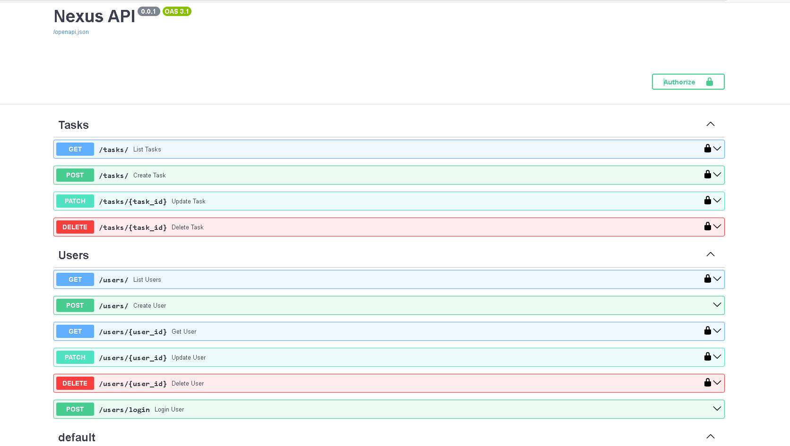

# 🚀 Nexus API


> [Português](#) | [English version below](#-nexus-api--english)

API REST desenvolvida em **Python** com **FastAPI** para gerenciamento de usuários e tarefas, com autenticação JWT, arquitetura modular em camadas, migrations com Alembic, testes com Pytest, CI com GitHub Actions e **frontend em React**.

---

## 📸 Preview do sistema

<p align="center">
  
</p>
<p align="center">
  <em>Documentação interativa (Swagger UI) — endpoints de usuários e tarefas.</em>
</p>

---

## 🛠️ Stack tecnológica

| Tecnologia | Uso no projeto |
|:-----------|:---------------|
| **Python 3.10+** | Linguagem principal |
| **FastAPI** | Framework web para a API |
| **SQLAlchemy** | ORM — modelos e mapeamento relacional |
| **Alembic** | Migrations e controle de schema |
| **SQLite / PostgreSQL** | SQLite em desenvolvimento, PostgreSQL em produção |
| **Docker** | Containerização da aplicação |
| **Passlib + Bcrypt** | Hash seguro de senhas |
| **python-jose (JWT)** | Geração e validação de tokens de acesso |
| **Pytest** | Testes automatizados |
| **Ruff 0.16.3** | Linting reproduzível no CI |
| **GitHub Actions** | Pipeline CI (lint → test) |
| **React + JavaScript** | Frontend (interface de usuário) |
| **Vite** | Build tool do frontend |
| **Axios** | Chamadas HTTP a partir do frontend |

---

## 📁 Estrutura do projeto

```
nexus/
├── .github/
│   └── workflows/
│       └── ci.yml              # Pipeline CI: lint (Ruff) + testes (Pytest)
├── alembic/
│   ├── versions/               # Histórico de migrations
│   └── env.py                  # Configuração do Alembic
├── app/
│   ├── api/
│   │   ├── endpoints/
│   │   │   ├── users.py        # Rotas de usuários
│   │   │   └── tasks.py        # Rotas de tarefas
│   │   └── api.py              # Registro de routers
│   ├── core/
│   │   ├── config.py           # Configurações via variáveis de ambiente
│   │   ├── security.py         # Lógica de JWT e hashing
│   │   └── logging_config.py   # Configuração de logs
│   ├── db/
│   │   └── database.py         # Engine e sessão SQLAlchemy
│   ├── models/
│   │   ├── user.py             # Modelo ORM de usuário
│   │   └── task.py             # Modelo ORM de tarefa
│   ├── schemas/
│   │   ├── user.py             # Schemas Pydantic de usuário
│   │   ├── task.py             # Schemas Pydantic de tarefa
│   │   └── token.py            # Schema de token JWT
│   └── main.py                 # Entry point FastAPI
├── Tests/
│   ├── test_api.py             # Testes dos fluxos HTTP
│   └── test_db.py              # Teste de conectividade configurada
├── frontend/                   # Interface React com Vite
├── docker-compose.yml
├── Dockerfile
├── alembic.ini
├── requirements.txt
└── .env.example
```

---

## 🚀 Endpoints

### Usuários

| Método | Rota | Autenticação | Descrição |
|:-------|:-----|:------------:|:----------|
| `POST` | `/users/` | ❌ | Criar usuário (registro) |
| `POST` | `/users/login` | ❌ | Login — retorna `access_token` |
| `GET` | `/users/` | ✅ | Listar usuários |
| `GET` | `/users/{user_id}` | ✅ | Obter usuário por ID |
| `PATCH` | `/users/{user_id}` | ✅ | Atualizar usuário (somente o próprio) |
| `DELETE` | `/users/{user_id}` | ✅ | Deletar usuário (somente o próprio) |

### Tarefas

| Método | Rota | Autenticação | Descrição |
|:-------|:-----|:------------:|:----------|
| `GET` | `/tasks/` | ✅ | Listar tarefas do usuário autenticado |
| `POST` | `/tasks/` | ✅ | Criar tarefa (associada ao usuário) |
| `PATCH` | `/tasks/{task_id}` | ✅ | Atualizar tarefa (somente dono) |
| `DELETE` | `/tasks/{task_id}` | ✅ | Deletar tarefa (somente dono) |

### Health

| Método | Rota | Descrição |
|:-------|:-----|:----------|
| `GET` | `/` | Health check |

> Documentação interativa em `/docs` (Swagger UI) e `/redoc`.

---

## ⚙️ Como rodar o projeto

### Pré-requisitos

- Python 3.10+
- Docker (opcional)

### Via ambiente virtual

```bash
git clone https://github.com/AndreLopes30/nexus-api.git
cd nexus-api

python -m venv venv
source venv/bin/activate   # Linux/macOS
venv\Scripts\activate      # Windows

pip install --upgrade pip
pip install -r requirements.txt
```

Crie o arquivo `.env` na raiz (use `.env.example` como base):

```env
SECRET_KEY=substitua-por-um-segredo-aleatorio-de-32-caracteres
ALGORITHM=HS256
ACCESS_TOKEN_EXPIRE_MINUTES=30
DATABASE_URL=sqlite:///./nexus.db
```

Aplique as migrations com Alembic:

```bash
alembic upgrade head
```

Inicie a API:

```bash
uvicorn app.main:app --reload
```

Acesse em: `http://127.0.0.1:8000/docs`

### Via Docker

```bash
docker-compose up --build -d

# Logs
docker-compose logs -f

# Parar
docker-compose down
```

---

## 🗄️ Migrations (Alembic)

O projeto usa **Alembic** para controle de schema — padrão em ambientes de produção.

```bash
# Aplicar migrations pendentes
alembic upgrade head

# Ver estado atual
alembic current

# Gerar nova migration após alterar um model
alembic revision --autogenerate -m "descricao_da_mudanca"

# Reverter última migration
alembic downgrade -1
```

> Sempre faça backup antes de rodar migrations em produção:
> ```bash
> pg_dump -Fc --file=backup.dump $DATABASE_URL
> ```

---

## 🔐 Autenticação

1. `POST /users/login` com `username` (email) e `password` em form data.
2. Copie o `access_token` da resposta.
3. Nas rotas protegidas, envie o header:

```
Authorization: Bearer <access_token>
```

No Swagger UI: clique em **Authorize** e cole o token.

O controle de acesso restringe as tarefas ao respectivo dono e permite que cada usuário altere ou exclua somente o próprio perfil.

---

## 🧪 Testes

```bash
# Executar a mesma suíte usada pelo CI
python -m pytest Tests/ -q
```

Os testes da API usam SQLite em memória com um pool estático, sem depender de banco externo. O teste de conectividade executa uma consulta somente leitura no banco definido por `DATABASE_URL`; o CI também aponta essa configuração para SQLite em memória.

---

## 🔄 CI

O pipeline roda automaticamente em todo push e pull request para `main`/`master`:

1. **Lint** — Ruff verifica estilo e qualidade do código
2. **Testes** — Pytest com banco SQLite em memória

Configuração em `.github/workflows/ci.yml`.

---

## 🧭 Decisões técnicas

**Separação em camadas (models / schemas / routes):** o modelo ORM não vaza para a API; o schema Pydantic valida a entrada antes de qualquer lógica de negócio.

**SQLite em dev, PostgreSQL em produção:** troca feita apenas via `DATABASE_URL` no `.env`, sem alteração de código — SQLAlchemy abstrai o dialeto.

**Alembic para migrations:** `Base.metadata.create_all()` não rastreia histórico de mudanças. Alembic permite evoluir o schema de forma controlada e reversível — essencial em produção.

**JWT com controle de acesso por recurso:** cada rota protegida valida se o usuário autenticado é o dono do recurso antes de qualquer operação.

**Pytest com SQLite em memória:** a suíte recria as tabelas entre os testes da API e não persiste um arquivo de banco no repositório.

**Ruff configurado e fixado no CI:** as regras estão declaradas em `pyproject.toml` e a versão usada pelo workflow é explícita. A exceção B008 é limitada aos arquivos que usam `Depends(...)`, padrão de injeção de dependência do FastAPI.

---

## 📌 Próximas melhorias

- Refresh tokens para renovação de sessão sem novo login
- Paginação e filtros nas rotas de tarefas
- Relatório de cobertura publicado pelo CI, quando houver uma meta de cobertura definida

---

## 👨‍💻 Autor

**André Ferreira**
[GitHub](https://github.com/AndreLopes30) · [LinkedIn](https://www.linkedin.com/in/andre-ferreira30)
<!-- end of Portuguese version -->
---
# 🚀 Nexus API — English


REST API built with **Python** and **FastAPI** for user and task management, featuring JWT authentication, layered architecture, Alembic migrations, automated tests, GitHub Actions CI, and a **React frontend**.

---

## 🛠️ Tech Stack

| Technology | Role |
|:-----------|:-----|
| **Python 3.10+** | Main language |
| **FastAPI** | Web framework |
| **SQLAlchemy** | ORM — models and relational mapping |
| **Alembic** | Database migrations and schema versioning |
| **SQLite / PostgreSQL** | SQLite in development, PostgreSQL in production |
| **Docker** | Containerization |
| **Passlib + Bcrypt** | Secure password hashing |
| **python-jose (JWT)** | Token generation and validation |
| **Pytest** | Automated tests |
| **Ruff 0.16.3** | Reproducible CI linting |
| **GitHub Actions** | CI/CD pipeline (lint → test) |
| **React + JavaScript** | Frontend (UI layer) |
| **Vite** | Frontend build tool |
| **Axios** | HTTP calls from the frontend |

---

## 🚀 Endpoints

### Users

| Method | Route | Auth | Description |
|:-------|:------|:----:|:------------|
| `POST` | `/users/` | ❌ | Register a new user |
| `POST` | `/users/login` | ❌ | Login — returns `access_token` |
| `GET` | `/users/` | ✅ | List users |
| `GET` | `/users/{user_id}` | ✅ | Get user by ID |
| `PATCH` | `/users/{user_id}` | ✅ | Update user (own only) |
| `DELETE` | `/users/{user_id}` | ✅ | Delete user (own only) |

### Tasks

| Method | Route | Auth | Description |
|:-------|:------|:----:|:------------|
| `GET` | `/tasks/` | ✅ | List tasks for authenticated user |
| `POST` | `/tasks/` | ✅ | Create task (linked to user) |
| `PATCH` | `/tasks/{task_id}` | ✅ | Update task (owner only) |
| `DELETE` | `/tasks/{task_id}` | ✅ | Delete task (owner only) |

> Interactive docs available at `/docs` (Swagger UI) and `/redoc`.

---

## ⚙️ Running locally

```bash
git clone https://github.com/AndreLopes30/nexus-api.git
cd nexus-api

python -m venv venv
source venv/bin/activate   # Linux/macOS
venv\Scripts\activate      # Windows

pip install --upgrade pip
pip install -r requirements.txt
```

Create a `.env` file at the project root:

```env
SECRET_KEY=replace-with-a-random-secret-of-at-least-32-characters
ALGORITHM=HS256
ACCESS_TOKEN_EXPIRE_MINUTES=30
DATABASE_URL=sqlite:///./nexus.db
```

Run migrations and start the API:

```bash
alembic upgrade head
uvicorn app.main:app --reload
```

Access at: `http://127.0.0.1:8000/docs`

---

## 🧪 Tests

```bash
pytest Tests/ -q
```

---

## 🔄 CI/CD

Every push and pull request to `main`/`master` triggers:
1. **Lint** — Ruff checks code quality
2. **Tests** — Pytest runs against an in-memory SQLite database

---

## 👨‍💻 Author

**André Ferreira**
[GitHub](https://github.com/AndreLopes30) · [LinkedIn](https://www.linkedin.com/in/andre-ferreira30)
<!-- end of README -->
